# DataBase Design

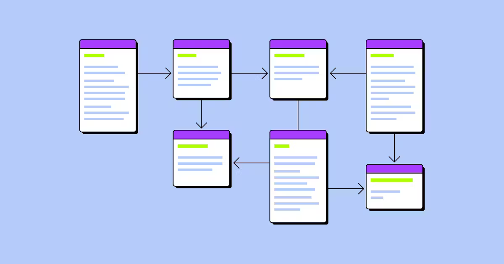

## Table of Contents

<ul>
<li><a href="#ghci-commands">GHCI commands</a></li>
</ul>

<ul>
<li></li>
</ul>

## RDBMS

- A **relational database** is a type of database that stores and organises data in tables with rows and columns. It is based on the relational model, which uses a structure that permits the identification and access of data with another piece of data in the database.
- An **RDBMS**, or **Relational Database Management System**, is a software system that manages relational databases and facilitates the creation, updating, and administration of a relational database using SQL. It supports data integrity, transaction processing, and concurrent access to ensure efficient and secure data management stored in relational database structures.

### **Popular RDBMS**

- **Oracle Database** - A comprehensive RDBMS solution for enterprise-level data management, known for its robust feature set, scalability, and security.
- **MySQL** - An open-source RDBMS widely used for web applications and as a component of the LAMP stack (Linux, Apache, MySQL, PHP/Python/Perl).
- **Microsoft SQL Server**: Microsoft developed a relational database management system to support various data types and applications, from small websites to large enterprise applications.
- **PostgreSQL**: An open-source, object-relational database system known for its standards compliance, extensibility, and support for advanced data types.
- **SQLite**: A C-library that implements a small, fast, self-contained, high-reliability, full-featured SQL database engine.

## Terminology

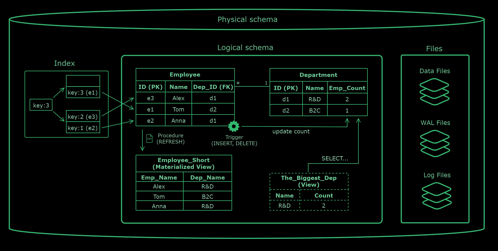

- **Physical Schema**: Describes how data is stored in the database, including files, indexes, and storage mechanisms. It deals with the optimisation of storage resources and data access methods.
- **Logical Schema**: Represents the abstract design of the data structure, including the tables and relationships, without detailing how data is stored physically. It focuses on defining entities, relationships, and constraints.
- **Table**: A collection of related data entries organised in rows and columns, representing a specific entity such as customers or orders.
- **Row**: A single, horizontal dataset in a table representing a specific entity instance, each row containing unique data for the defined columns.
- **Column**: A vertical dataset in a table representing an entity's attribute, where each column holds data of a particular type.
- **Constraints**: Rules enforced on database tables and columns to ensure data integrity and accuracy and enforce business logic, preventing invalid data entry and maintaining consistency across the database.
  - **Primary key**: Ensures each row in a table has a unique identifier, disallowing NULL values.
  - **Foreign key**: Establishes a relationship between tables, ensuring that one table's value matches another table's primary key.
  - **Unique**: Guarantees that all values in a column or a set of columns are distinct, allowing for one NULL value if not part of a PRIMARY KEY.
  - **Check**: Specifies a condition that each value in a column must meet, ensuring data adheres to specific rules.
  - **Not NULL**: Ensures that a column cannot hold NULL values, guaranteeing that data is always entered for specific columns.
  - **Default**: Assigns a default value to a column when no other value is specified during data insertion.
- **Index**: A data structure that improves the speed of data retrieval operations on a table, making finding rows based on the column values faster.
- **Stored Procedures**: Predefined SQL commands stored in the database that can be executed to perform various operations, including data manipulation and transaction management.
- **Triggers**: Procedures automatically executed in response to specific events on a particular table or view, such as insertions, updates, or deletions.
- **Views**: Virtual tables created based on the result set of an SQL statement, which can simplify complex queries, aggregate data, or restrict access to specific data within the database.
- **Materialised View**: A physical copy of the result set of a specific SQL query stored in the database. Unlike virtual views, which query the underlying tables every time they are accessed, materialised views are updated periodically.

## Database Design Strategies

## ER (Entity Relationship) Diagram

An Entity-Relationship (ER) diagram is a graphical representation of entities and their relationships to each other. An ER diagram helps structure and organise data requirements before developing a database.

**Components**

- **Entities**: Represent real-world objects or concepts in the database.
  - **Strong Entity:** A type of entity that has a key Attribute
  - **Weak Entity**: An entity that does not have a primary key attribute.
- **Attributes**: Characteristics or properties of entities.
  - **Key Attribute**: Used to represent the main characteristics of an entity. It represents a primary key.
  - **Composite Attribute**: An attribute that is composed of many other attributes
  - **Multivalued Attribute**: An attribute that can have multiple values.
  - **Derived Attribute**: An attribute that can be derived from another attribute
- **Relationships**: Depict how entities are related to each other.
  - **One-to-One**
  - **One-to-Many**
  - **Many-to-One**
  - **Many-to-Many**

**Types**

- **Conceptual**: High-level, abstract design without specific details about technologies or data types.
- **Logical**: More detailed, including specific entities, relationships, and attributes but not entirely tied to a particular database management system (DBMS).
- **Physical**: Includes all constraints, indexes, and specific technologies that will be implemented in the database.

There a several ERD **notations**: Chen, Crow's Foot(Information Engineering), Barker's, IEC, Martin and etc. Each notation has its advantages and is chosen based on the preferences of the database designers, the complexity of the system being modelled, and the project's specific requirements. Crow's Foot and Chen's notations remain among the most popular.

#### Chen notation

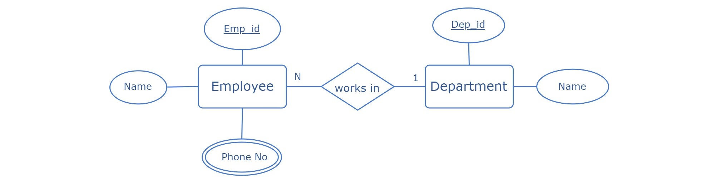

#### Crow's Foot / Information Engineering

## Design Patterns

Design patterns for relational databases are reusable solutions to common problems encountered when designing database schemas, querying data, and implementing database-related functionalities. Here are some key design patterns for relational databases:

### Normalization

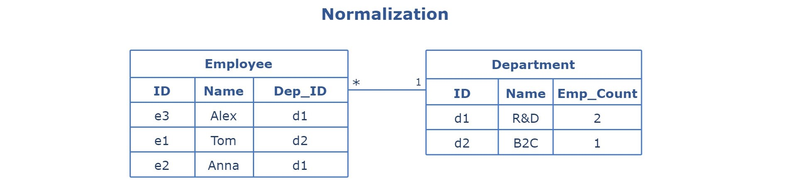
Normalization involves applying a set of rules or "normal forms" to ensure the database structure is clear, efficient, and able to handle updates and queries reliably. It aims to reduce redundancy and improve data integrity by ensuring that each piece of data is stored only once.

**Pros:**

- **Improved Data Integrity**: Normalization ensures accurate and consistent data, enhancing the overall integrity of the database.
- **Reduced Data Redundancy**: It minimizes duplicate data storage, saving space and simplifying data management.
- **Easier Database Maintenance**: Normalized structures simplify updates, inserts, and deletions, making maintenance tasks more straightforward.

**Cons:**

- **Complex Queries**: Normalization can lead to complex queries due to the need to join multiple tables to retrieve related data.
- **Performance Issues**: The additional joins required by normalized databases can slow query performance, especially in large or high-transaction systems.
- **Design Complexity**: Achieving optimal normalization requires careful, often complex planning and design, posing challenges for those who need more experience.

#### Normal Forms

Normal forms are a series of guidelines or rules used in normalization. There are several normal forms, each building upon the principles of the previous one. While achieving high levels of normalization offers significant benefits, it comes with tradeoffs regarding performance and ease of use. Balancing these factors requires careful consideration based on the specific demands of the application.

##### **First Normal Form (1NF)**

- Each column in a table contains only a single value.
- Each column has a unique name.
- Order in which data is stored should not matter.
  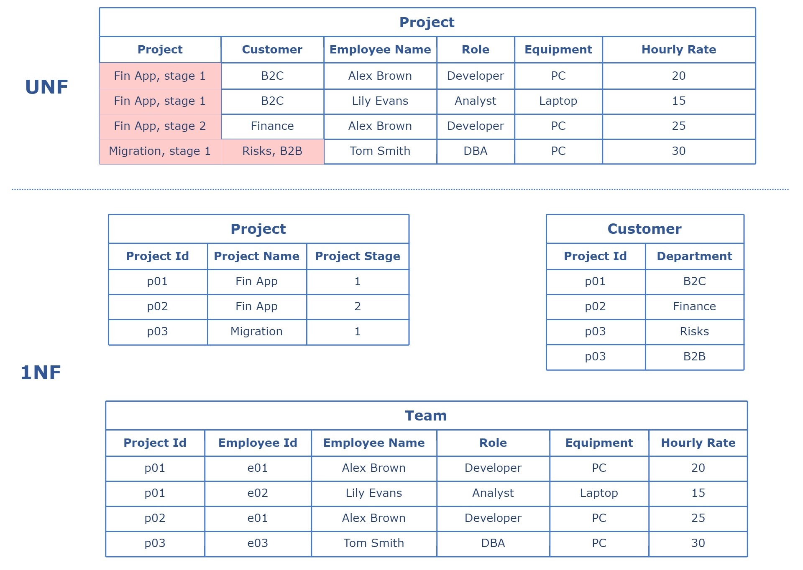

##### Second Normal Form (2NF)

- All non-key attributes are fully functional dependent on the primary key (PK).
- If the table has a **composite** PK, then each non-key attribute must be fully dependent on the entire PK and not on a subset of the PK
  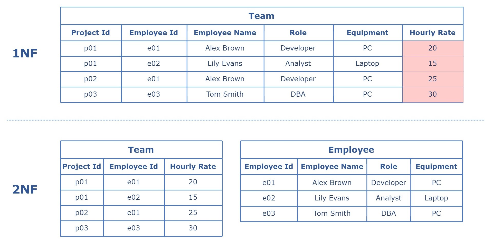

##### Third Normal Form (3NF)

- No transition dependency exists, ensuring that non-key attributes are **not** dependent on other non-key attributes.
  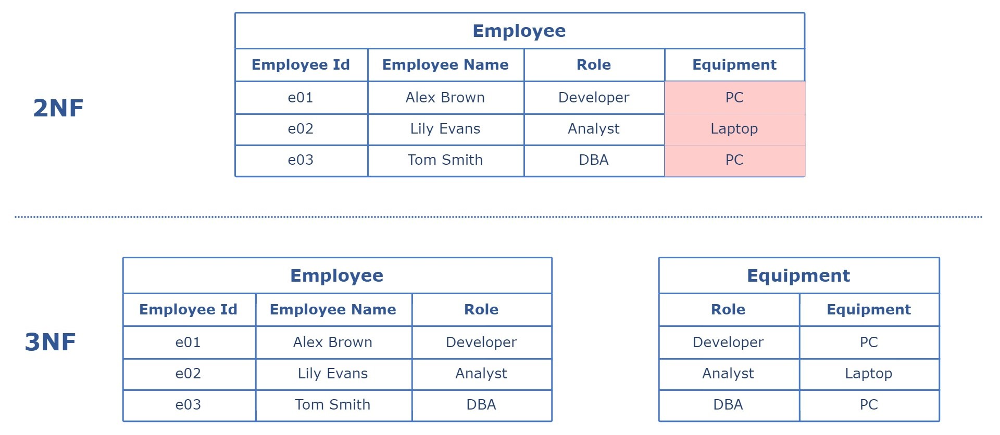

##### Boyce-Codd Normal Form (BCNF)

- It is a special case of 3NF.
- Table that should **not** have multiple overlapping candidate keys.
- 3NF wouldn't prohibit an attribute within one candidate key that depends on a _part_ of another candidate key.
  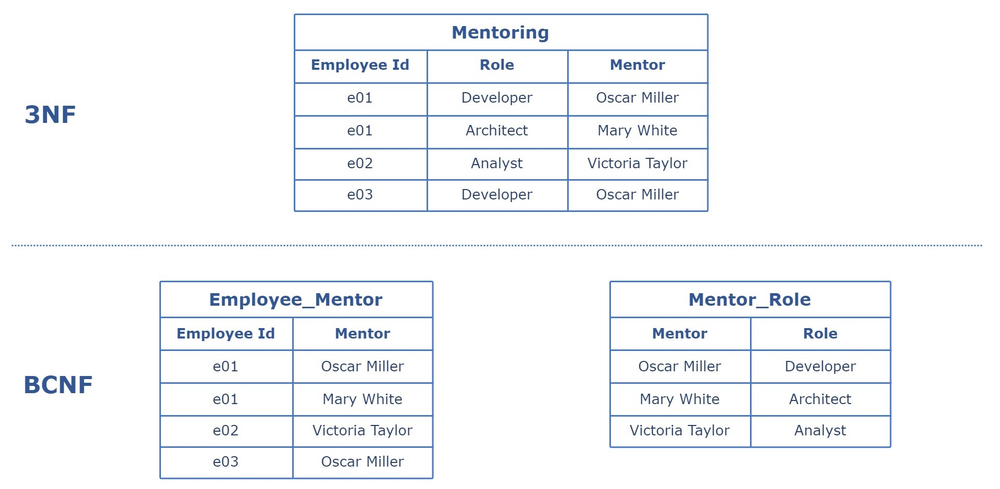

##### Fourth Normal Form (4NF)

- Table should not have two or more, independent and multivalued data describing the relevant entity.
  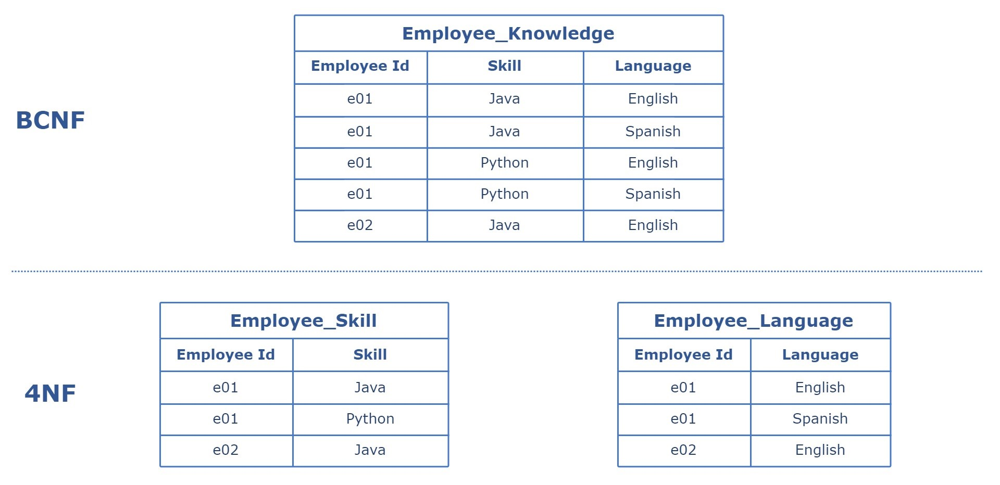

##### Fifth Normal Form (5NF)

- Table can be decomposed into any number of smaller tables without loss of data.
  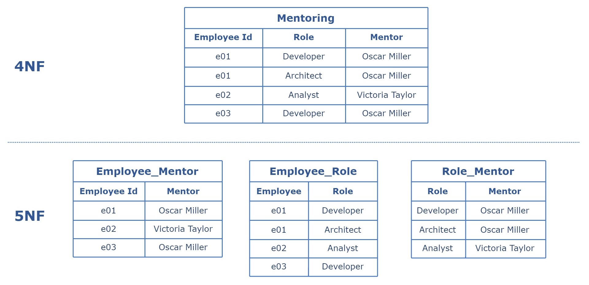

### Denormalization

Denormalization is adding redundant data to a normalized database to improve query performance, simplify the database structure, or address issues with read-heavy database applications that require fast access to data.

**Pros:**

- **Improved Query Performance**: Denormalization can significantly speed up read operations by reducing the number of joins needed.
- **Simplified Queries**: It simplifies query writing and understanding by reducing the complexity of database schemas.
- **Enhanced Performance for Specific Tasks**: Optimizes performance for specific read-heavy operations, making it beneficial for certain applications.

**Cons:**

- **Increased Data Redundancy**: Introduces duplicate data, which can lead to inconsistencies and increased storage requirements.
- **Higher Maintenance Overhead**: The redundancy requires more effort to ensure data integrity during updates, inserts, and deletes.
- **Risk of Data Anomalies**: There's a greater risk of insert, update, and delete anomalies, potentially leading to data integrity issues.

### Entity-Attribute-Value (EAV)

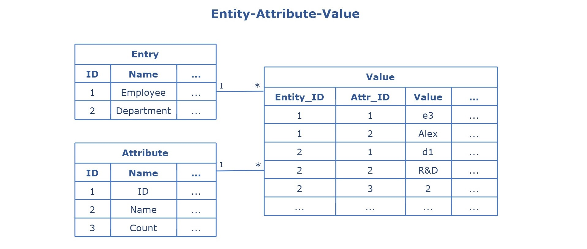
EAV is a database design pattern used to represent entities. A unique identifier represents each entity, each attribute is represented as a record, and the attribute's value for the entity is stored in a separate table. This model allows for the flexible and dynamic addition of attributes without altering the database schema.

**Pros:**

- **Flexibility**: Allows for the dynamic addition of attributes to entities without modifying the database schema.
- **Scalability for Sparse Data**: Efficiently stores entities with many attributes that are primarily null in traditional relational database designs.
- **Complex Hierarchies and Relationships**: Facilitates modelling complex hierarchies and relationships that are difficult to represent in traditional relational databases.

**Cons:**

- **Query Complexity**: Retrieving data can require complex queries that join multiple tables, which can be challenging to write and maintain.
- **Performance Issues**: This can lead to performance bottlenecks due to the intensive joins required to reconstruct entity data.
- **Data Integrity Challenges**: Maintaining data integrity is more complicated due to the scattered nature of the data across multiple tables.

### Master-Detail

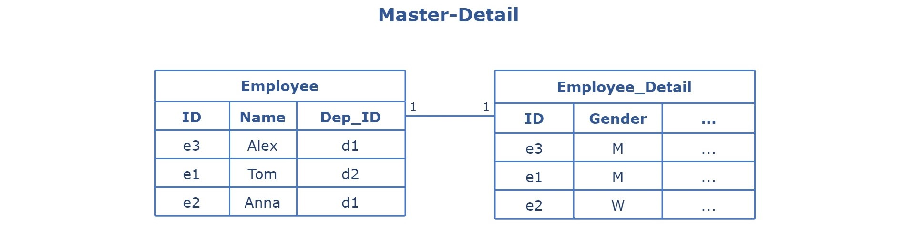
The Master-Detail pattern involves two interconnected tables: a master table that holds primary information and one or more detail tables that contain related data linked back to the master table through foreign keys. This pattern is commonly used to manage related data entities where the master entity controls various operations of the detail entities, such as cascading updates or deletions.

**Pros:**

- **Clear Hierarchy**: Establishes a clear and logical data hierarchy, making the database structure more understandable.
- **Data Integrity**: Ensures data integrity through referential integrity constraints, maintaining consistent relationships between master and detail records.
- **Efficient Data Organization**: Facilitates data organisation in a way that reflects real-world relationships, making data retrieval and analysis more straightforward.

**Cons:**

- **Complex Joins for Queries**: Retrieving data that spans across the master and detail tables can require complex SQL joins, potentially impacting query performance.
- **Cascade Operations Risk**: Cascading updates or deletions can unintentionally affect multiple detail records, posing a risk to data integrity if not carefully managed.
- **Scalability Issues**: As the volume of detail records grows, the performance of operations that involve cascading changes or extensive joins may degrade, impacting scalability.

### Table Inheritance

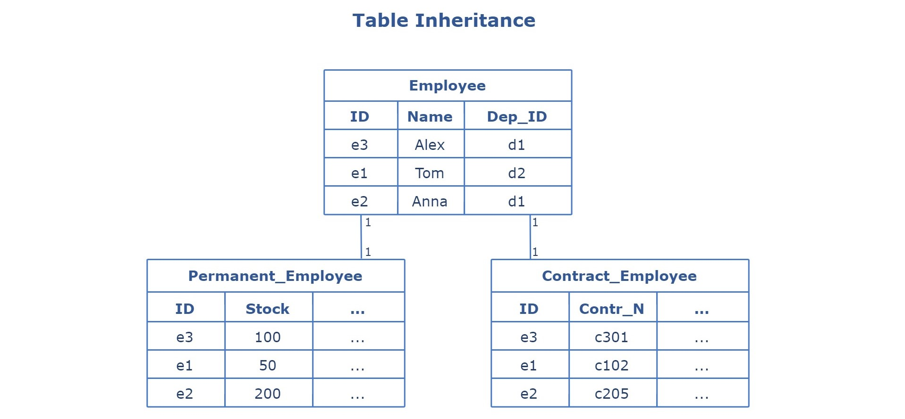
Table Inheritance involves creating a table structure that mimics the inheritance of entities or objects in an application, typically using one of three approaches, each with varying strategies for how data is stored across parent and child tables:

- Single Table Inheritance
- Class Table Inheritance
- Concrete Table Inheritance

**Pros:**

- **Reflects Object-Oriented Models**: It closely aligns the database schema with the application's object-oriented model, facilitating a more intuitive design and implementation process.
- **Polymorphism Support**: Supports polymorphism, allowing queries to easily retrieve or manipulate instances of base classes or subclasses stored in the database.
- **Efficient Data Organization**: Organizes data in a way that can improve the clarity and logical structure of the database, making it easier to understand the relationships between different entities.

**Cons:**

- **Complexity in Querying**: Queries can become more complex, especially when dealing with polymorphic associations or needing to join multiple tables to reconstruct a single object.
- **Potential Performance Overhead**: The need to join multiple tables for single object reconstruction can introduce performance overhead in read operations.
- **Schema Evolution Difficulties**: Modifying the inheritance hierarchy can lead to challenging schema migrations, requiring careful management of parent and child tables to maintain data integrity.

### Star

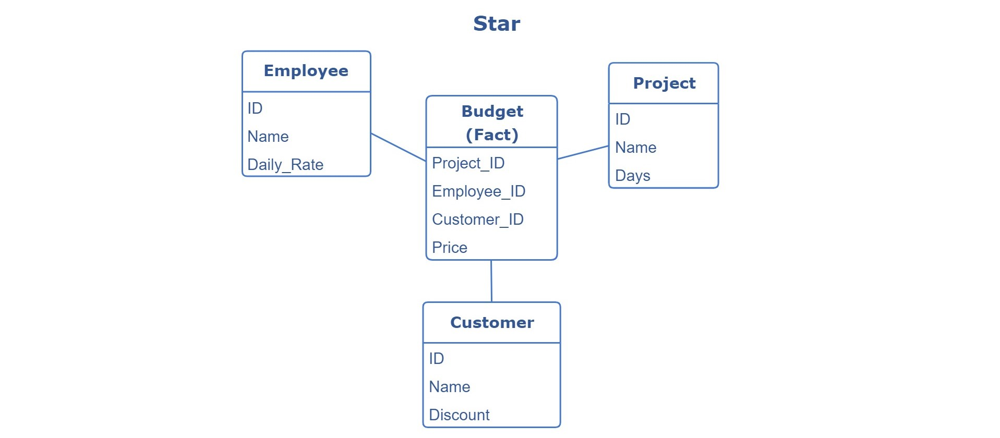
TThe Star Schema organizes data into a central fact table that contains quantitative metrics (facts) and foreign keys to related dimension tables, which store descriptive attributes related to the facts. This pattern resembles a star, with the fact table at the centre and dimension tables radiating outwards.

**Pros:**

- **Simplified Queries**: The structure simplifies query writing, making it easier to perform complex data analytics and reporting.
- **Improved Performance**: Optimized for query performance in analytical processing, facilitating fast data retrieval.
- **Intuitive Design**: The clear separation between dimensions and facts makes the schema easy to understand and navigate, even for non-technical users.

**Cons:**

- **Data Redundancy**: Dimension tables can introduce redundancy, increasing storage requirements.
- **Complex ETL Processes**: Extract, Transform, Load (ETL) processes can become complex and time-consuming due to the need to populate multiple dimension tables.
- **Not Suitable for Transactional Processing**: The design is optimized for querying and reporting, making it less suitable for transactional processing where data is frequently updated.

### Snowflake

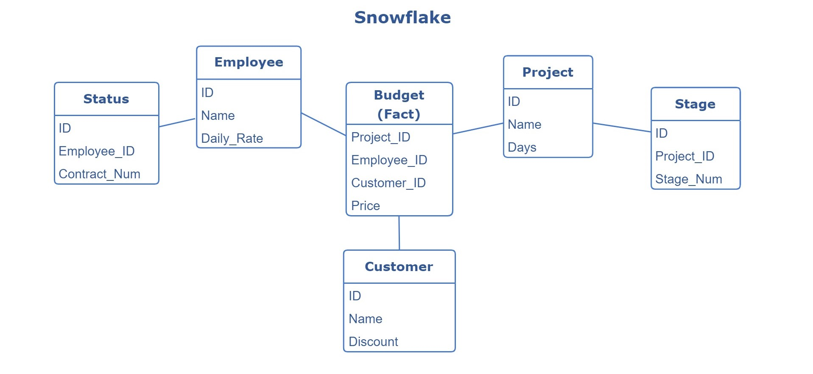
The Snowflake Schema organizes data into a central fact table surrounded by normalized dimension tables. Unlike the Star Schema, where dimension tables are denormalized, in the Snowflake Schema, dimension data is broken down into additional tables to eliminate redundancy and enforce data integrity.

**Pros:**

- **Reduced Data Redundancy**: Normalization of dimension tables reduces data redundancy, leading to more efficient storage use.
- **Improved Data Integrity**: The normalization process enhances data integrity and consistency across the database.
- **Detailed Data Hierarchy**: Allows a more detailed representation of data hierarchies and relationships within dimensions.

**Cons:**

- **Increased Query Complexity**: The additional joins required to navigate the normalized dimensions can make queries more complex and more challenging to write.
- **Potential Performance Overhead**: The normalization and additional table joins may lead to slower query performance than the Star Schema.
- **Complex ETL Processes**: Populating the normalized dimension tables can complicate ETL (Extract, Transform, Load) operations, requiring more sophisticated logic and processing time.

### Audit logging

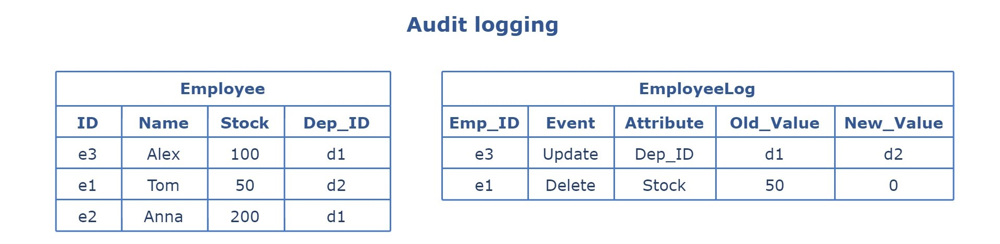
Audit Logging pattern in databases is a design approach focused on systematically recording changes to data or actions performed within an application or system. It involves creating detailed logs for all create, read, update, and delete (CRUD) operations on data, providing a transparent and immutable history of all transactions and changes within the database for security, compliance, and debugging purposes.

**Pros:**

- **Enhanced Security and Compliance**: Ensures compliance with legal and regulatory requirements by maintaining a detailed record of all data accesses and changes.
- **Improved Accountability**: Establishes clear accountability by tracking user actions, making identifying the source of changes or errors easier.
- **Valuable Insights**: Offers valuable insights into application usage patterns, data access, and changes over time, facilitating better decision-making and system improvements.

**Cons:**

- **Increased Storage Requirements**: Generates significant log data, increasing storage costs and requirements.
- **Performance Overhead**: This can introduce performance overhead, as every data operation requires additional logging actions.
- **Complexity in Management and Analysis**: The volume and complexity of audit logs can make management and analysis challenging, requiring specialized tools or processes.

### Versioning

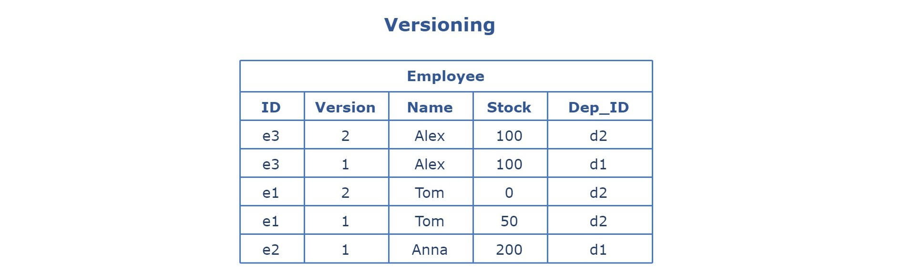
The Versioning pattern in databases is a strategy used to keep track of changes to data over time by maintaining historical versions of data records alongside the current version. This pattern allows applications to access, query, and revert to previous states of the data.

Versioning involves adding metadata to each record in a database to indicate its version, with mechanisms to create new versions upon updates while preserving the old versions. This can be implemented through various means, such as additional versioned tables, timestamping, or a separate history table to store changes.

**Pros:**

- **Historical Data Preservation**: Enables tracking and preservation of historical data, allowing for analysis of changes over time.
- **Audit Trail**: Provides a comprehensive audit trail for changes, supporting compliance and security analyses.
- **Data Recovery**: Facilitates data recovery and rollback capabilities, allowing previous data states to be restored if necessary.

**Cons:**

- **Increased Storage Space**: Requires additional storage space to maintain historical data versions.
- **Complex Queries**: This can complicate query design, as accessing the current or a specific historical data version may require more complex queries.
- **Performance Impact**: Maintaining and accessing multiple versions of data can lead to performance degradation, especially with large datasets or frequent updates.

## Scaling and Fault Tolerance

Scaling and fault tolerance are critical aspects of managing relational databases, especially in environments that require high availability, performance, and consistency. These concepts ensure that a database can handle growing amounts of work and recover from hardware or software failures without data loss.

**Scaling** refers to the database's ability to accommodate growth in data volume and transaction throughput without compromising performance. It can be achieved in two primary ways:

- **Vertical Scaling (Scaling Up)**: Add more resources (e.g., CPU, RAM) to the existing database server to handle increased load.
- **Horizontal Scaling (Scaling Out)**: Entails distributing the database load across multiple servers or instances to enhance capacity and performance.

**Fault tolerance** refers to the ability of the database system to continue operating without interruption in the event of a hardware or software failure. Key strategies include:

- **Replication**: Replicates data across multiple nodes or locations to prevent data loss and ensure availability during failures.
- **Clustering**: Utilizes a group of servers working together to provide high availability and distribute the load, ensuring continuous operation even if one server fails.
- **Backup and Recovery**: Regular backups and efficient recovery procedures are essential for restoring data after a failure.

There are several techniques for scaling and improving reliability.

### Master-Slave (Primary-Secondary) replication

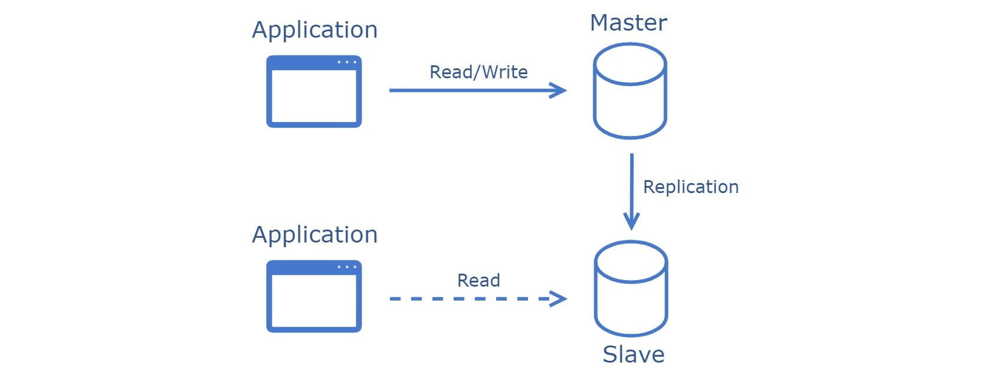
Master-slave replication is a widely used architecture for data replication and distribution. It involves a primary database server (the master) and one or more secondary database servers (the slaves). The master server handles all the write and/or read operations and logs changes, while the slave servers replicate these changes from the master, allowing them to handle read queries.

**Benefits:**

- **Read Scalability**: Distributes read queries among multiple slave servers, significantly improving the system's ability to handle large volumes of read operations.
- **High Availability**: Increases database availability through replicas; if the master server fails, a slave can be promoted to a master, minimizing downtime.
- **Load Distribution**: Allows for effective distribution of database load, with the master handling writes and slaves handling reads.
- **Backup and Maintenance**: Facilitates backups and maintenance tasks on slave servers without impacting the master server's performance or availability.

**Tradeoffs:**

- **Write Scalability**: This does not improve write scalability as all write operations must go through the master server.
- **Data Latency**: There can be a delay (replication lag) between when data is written to the master and when it is available on the slave servers, potentially leading to stale data.
- **Complexity**: Introduces complexity in setup, configuration, and maintenance, requiring careful management of replication processes and failover mechanisms.
- **Consistency Concerns**: In an asynchronous replication setup, there is a risk of temporary inconsistency between the master and slave databases.

**Use Cases:**

- **Read-Heavy Applications**: Ideal for applications with a high read-to-write ratio, such as content delivery networks, where distributing read operations can significantly improve performance.
- **Reporting and Analytics**: Useful for running complex queries and reports on slave databases without impacting the performance of the master database or the main application.
- **Backup and Recovery**: Enables real-time backups on slave servers without interrupting the master server, providing an effective strategy for data recovery and business continuity.
- **System Upgrades and Testing**: Allows for testing new features, system upgrades, or migrations on slave servers without risking the integrity of the master server or disrupting the live environment.

### Multi-Master (Master-Master, Primary-Primary ) replication

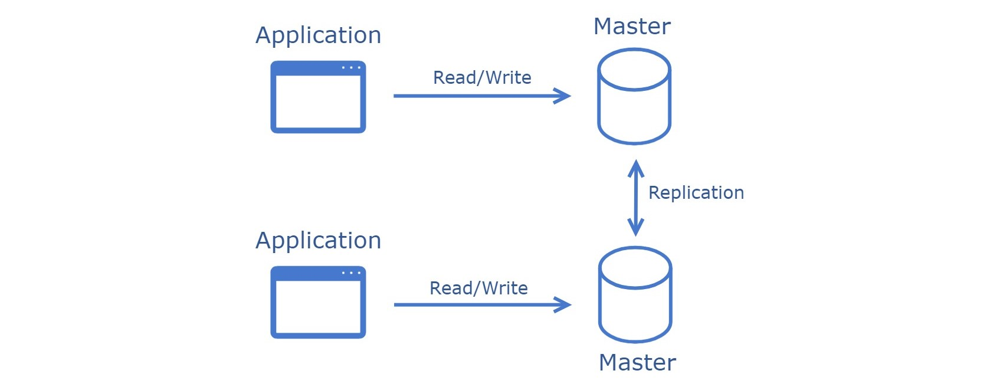

Multi-master replication is an architecture that allows data to be replicated across multiple servers, each capable of handling read and write operations. This setup creates a distributed database system where changes made on one server are automatically replicated to all other servers in the replication group, ensuring each server has the same data set.

**Benefits:**

- **Write Scalability**: Enhances write Scalability by distributing write operations across multiple servers, thereby improving the system's overall throughput.
- **High Availability**: Provides high availability and fault tolerance, as the system can continue to operate even if one or more servers fail.
- **Improved Data Locality**: Enables data to be located closer to its users, reducing access latency and improving application response times, especially in geographically distributed applications.
- **Conflict Resolution**: Often includes mechanisms for conflict resolution, ensuring data consistency across the replicated servers despite concurrent writes.

**Tradeoffs:**

- **Conflict Management**: Requires sophisticated conflict resolution strategies to handle concurrent writes to the same data, which can complicate application logic and database management.
- **Increased Overhead**: The replication and synchronization processes introduce additional network traffic and processing overhead, impacting system performance.
- **Complexity in Setup and Maintenance**: The configuration, monitoring, and maintenance of a multi-master replication system are more complex than single-master setups, requiring advanced expertise.
- **Data Consistency Challenges**: Ensuring immediate consistency across all nodes can be difficult, potentially leading to temporary inconsistencies until replication is completed.

**Use Cases:**

- **Distributed Applications**: Ideal for applications requiring data to be available and up-to-date across multiple locations, such as global e-commerce platforms or distributed content management systems.
- **Highly Available Systems**: Suitable for systems where high availability and fault tolerance are critical, ensuring that the application remains operational even in the event of server failures.
- **Collaborative Applications**: Useful in scenarios where multiple users must update shared data simultaneously, such as collaborative editing platforms or distributed ledgers.
- **Load Balancing**: This can balance the load across servers in high-traffic scenarios, ensuring no single server becomes a bottleneck.

### Sharding

Sharding is a technique that scales databases horizontally by partitioning data across multiple servers or instances. Each shard contains a subset of the total data; collectively, the shards comprise the entire database.

**Benefits:**

- **Scalability**: Significantly improves the scalability of a database by allowing it to distribute data across multiple servers, thereby handling more transactions and storing more data than a single server could.
- **Performance Improvement**: By distributing the data, sharding can reduce the load on any single server, leading to performance improvements in data retrieval and storage.
- **High Availability**: If properly implemented, sharding can increase data availability by replicating shards across multiple servers, thus ensuring that the failure of a single server does not lead to a total system outage.

**Tradeoffs:**

- **Complexity**: Sharding introduces complexity regarding database design, development, and maintenance. Managing multiple shards requires sophisticated coordination and configuration.
- **Data Distribution Challenges**: Ensuring an even distribution of data across shards to prevent imbalances (hotspots) that can lead to performance bottlenecks is challenging.
- **Cross-Shard Transactions**: Handling transactions spanning multiple shards can be complicated and require additional logic to maintain data consistency and integrity.

**Use Cases:**

- **Large-Scale Web Applications**: Ideal for web applications that require high throughput and storage capacity beyond the limits of a single database server.
- **Real-Time Analytics**: Supports real-time analytics applications that need to process and analyze large volumes of data quickly by distributing the workload across multiple servers.
- **Global Distributions**: Suitable for applications requiring global data distribution to serve users from the nearest geographical location, improving access speed and user experience.

### Federation

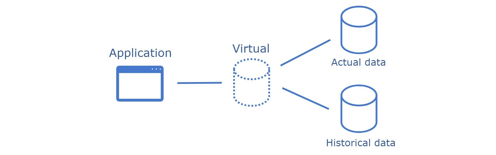
Federation is a strategy for managing and accessing data distributed across multiple databases or different systems. It involves creating a virtual database that abstracts several physical databases, allowing users to interact with it as if it were a single database. This approach enables the integration of diverse data sources, providing unified access and manipulation of data without consolidating it physically in one location.

**Benefits:**

- **Access to Distributed Data**: Simplifies access to data distributed across different databases or systems, making it appear that the data comes from a single source.
- **Reduced Data Redundancy**: By allowing data to remain in its original location, federation reduces the need for data replication and consolidation, minimizing redundancy.
- **Scalability and Flexibility**: Offers the ability to scale out systems and add new data sources without significant reconfiguration, providing flexibility in handling growing or changing data needs.

**Tradeoffs:**

- **Query Performance**: Queries that span multiple federated databases may experience higher latencies due to the overhead of integrating results from different sources.
- **Complexity in Management**: Managing and maintaining federated database systems can be significant, especially when integrating heterogeneous databases with varying schemas.
- **Data Consistency Challenges**: Ensuring data consistency and integrity across federated databases requires robust synchronization and conflict resolution mechanisms.

**Use Cases:**

- **Data Integration from Multiple Sources**: Ideal for scenarios where data needs to be integrated and accessed from multiple databases, such as in enterprise environments with different departmental databases.
- **Business Intelligence and Analytics**: The federation can facilitate business intelligence and analytics applications by providing unified access to diverse data sets spread across multiple databases.
- **Decentralized Organizations**: Suitable for decentralized organizations that require access to data across different regions or departments without centralizing all data, maintaining autonomy while ensuring data accessibility.
